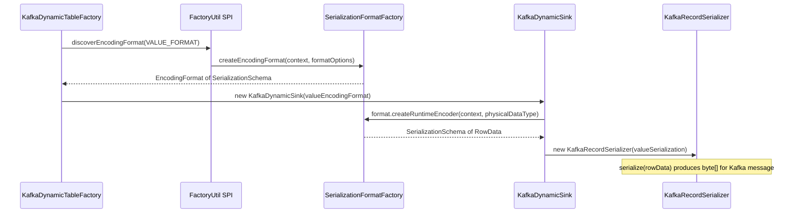
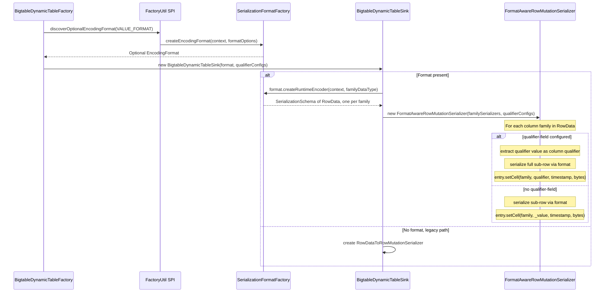
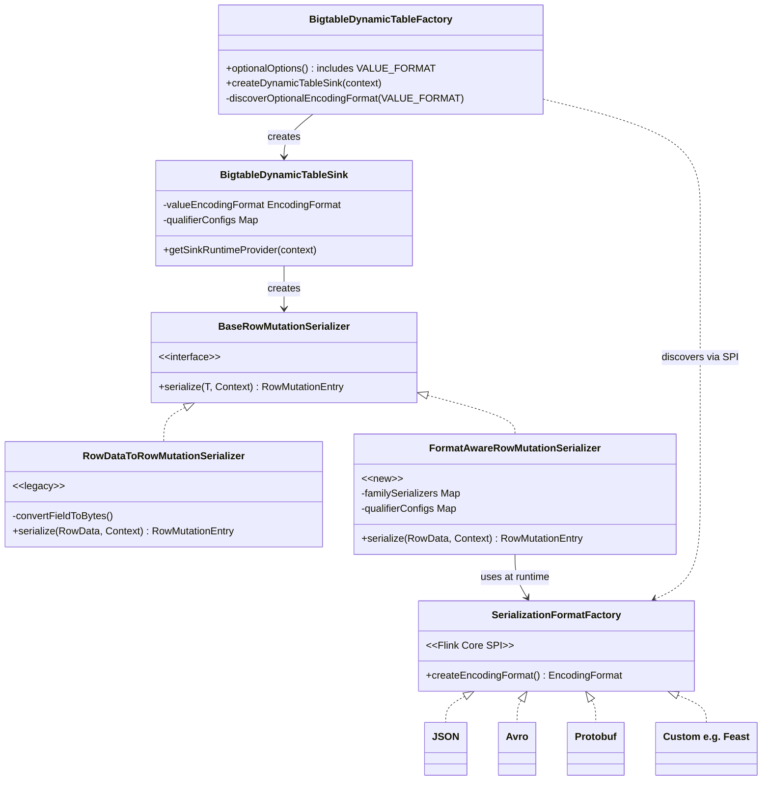
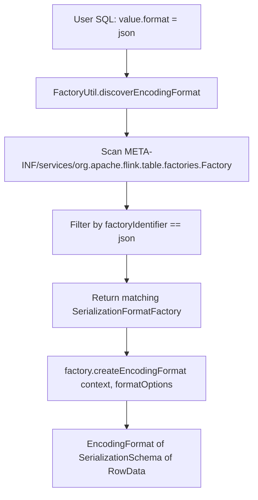
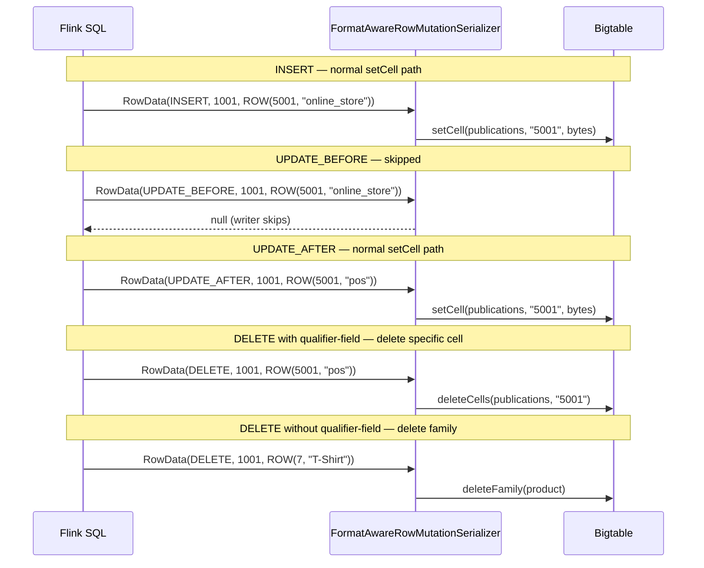
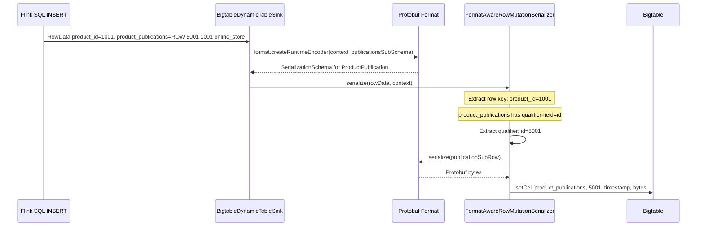

# Format-Agnostic Bigtable Connector Design

## 1. Problem Statement

The Bigtable Flink connector currently hardcodes its serialization logic in `RowDataToRowMutationSerializer`. Each `RowData` field is converted to bytes using a fixed `ByteBuffer`-based encoding (`convertFieldToBytes()`). This creates three problems:

1. **No standard format support.** Users cannot use Protobuf, Avro, JSON, or any other Flink format with the connector.
2. **No extensibility.** Third parties (e.g., Shopify with Feast) cannot bring their own encoding without forking the connector.
3. **Proprietary byte layout.** The byte representation is specific to this connector — only this connector can decode it.

### Goal

Make the connector **format-agnostic** using a factory/SPI pattern. Any format that implements the factory interface works automatically. Third parties can write their own format plugins.

### Inspiration: Kafka Flink Connector

Kafka's Flink connector uses Flink's built-in `SerializationFormatFactory` and `DeserializationFormatFactory` SPI. The `KafkaDynamicTableFactory` discovers format factories at runtime via `FactoryUtil.discoverEncodingFormat()`:

```java
// KafkaDynamicTableFactory.java (simplified)
EncodingFormat<SerializationSchema<RowData>> valueEncodingFormat =
    helper.discoverEncodingFormat(SerializationFormatFactory.class, VALUE_FORMAT);
```

The connector never knows what format is being used. It receives an `EncodingFormat` that produces a `SerializationSchema<RowData>` — a function from `RowData → byte[]`. This works for Kafka because Kafka messages are single key/value byte blobs.

### Why Standard Flink Formats Are Not Enough

Flink's standard `SerializationSchema<RowData>` maps an entire `RowData` to a single `byte[]`. This maps naturally to systems like Kafka where a message is one blob. For Bigtable, using the standard format would mean encoding an entire column family's sub-row as **a single blob stored in one cell**:

```
Row "1001":
  product:_value              → [Avro bytes of {shop_id: 7, title: "Classic T-Shirt"}]
  product_publications:_value → [Avro bytes of {id: 5001, product_id: 1001, channel: "online_store"}]
```

This loses Bigtable's core strengths:

- **No per-column reads.** You cannot read just `title` without deserializing the entire blob.
- **No per-column filters.** Bigtable's server-side column filters become useless.
- **No wide-row collections.** You cannot store multiple publications per product as separate cells keyed by `id` — the most common Bigtable data modeling pattern.
- **No column-level TTL or garbage collection.** Bigtable GC policies operate at the column family + qualifier level.

Bigtable's data model (row key → column family → column qualifier → timestamped cell values) requires a **Bigtable-specific format interface** that understands this cell-level structure.

## 2. Running Example

All examples in this document use the following Bigtable table:

```
Table: products
Row Key: product_id (BIGINT)

Column Family: product
  - shop_id (BIGINT)
  - title (STRING)

Column Family: product_publications
  - id (BIGINT)              ← column qualifier
  - product_id (BIGINT)
  - channel (STRING)

  (Many publications per product — one cell per publication, keyed by id)
```

### Current Flink SQL (no format support)

Today, the connector only supports flat or single-level nested schemas with a hardcoded byte encoding:

```sql
-- Current: flat mode (single column family)
CREATE TABLE products_flat (
  product_id BIGINT NOT NULL,
  shop_id BIGINT,
  title STRING,
  PRIMARY KEY (product_id) NOT ENFORCED
) WITH (
  'connector'     = 'bigtable',
  'project'       = 'my-project',
  'instance'      = 'my-instance',
  'table'         = 'products',
  'column-family' = 'product'
);

-- Current: nested rows mode (multiple column families, one cell per field)
CREATE TABLE products_nested (
  product_id BIGINT NOT NULL,
  product ROW<shop_id BIGINT, title STRING>,
  product_publications ROW<id BIGINT, channel STRING>,
  PRIMARY KEY (product_id) NOT ENFORCED
) WITH (
  'connector'            = 'bigtable',
  'project'              = 'my-project',
  'instance'             = 'my-instance',
  'table'                = 'products',
  'use-nested-rows-mode' = 'true'
);

INSERT INTO products_nested
VALUES (1001, ROW(7, 'Classic T-Shirt'),
              ROW(5001, 'online_store'));
```

**Limitation:** Only one publication per product. The byte encoding is proprietary. There is no way to use Protobuf, Avro, or a custom format.

### Proposed Flink SQL (with format support)

```sql
-- Proposed: format-agnostic with qualifier-keyed collections
CREATE TABLE products (
  product_id BIGINT NOT NULL,
  product ROW<shop_id BIGINT, title STRING>,
  product_publications ROW<id BIGINT, product_id BIGINT, channel STRING>,
  PRIMARY KEY (product_id) NOT ENFORCED
) WITH (
  'connector'                          = 'bigtable',
  'project'                            = 'my-project',
  'instance'                           = 'my-instance',
  'table'                              = 'products',
  'use-nested-rows-mode'               = 'true',
  'value.format'                       = 'protobuf',
  'product_publications.qualifier-field' = 'id'
);
```

Inserting multiple publications for the same product:

```sql
-- Each INSERT creates/updates one cell in the product_publications column family.
-- The row key (product_id) determines the Bigtable row.
-- The qualifier field (id) determines the column qualifier within that family.
INSERT INTO products
VALUES (1001, ROW(7, 'Classic T-Shirt'),
              ROW(5001, 1001, 'online_store'));

INSERT INTO products
VALUES (1001, NULL,
              ROW(5002, 1001, 'pos'));

INSERT INTO products
VALUES (1001, NULL,
              ROW(5003, 1001, 'wholesale'));
```

Resulting Bigtable state:

```
Row "1001":
  product:_value              → [Protobuf bytes of {shop_id: 7, title: "Classic T-Shirt"}]
  product_publications:5001   → [Protobuf bytes of {id: 5001, product_id: 1001, channel: "online_store"}]
  product_publications:5002   → [Protobuf bytes of {id: 5002, product_id: 1001, channel: "pos"}]
  product_publications:5003   → [Protobuf bytes of {id: 5003, product_id: 1001, channel: "wholesale"}]
```

The cell value contains the **full record** including the qualifier field, making each cell self-describing.

### Example with JSON format

```sql
CREATE TABLE products_json (
  product_id BIGINT NOT NULL,
  product ROW<shop_id BIGINT, title STRING>,
  product_publications ROW<id BIGINT, product_id BIGINT, channel STRING>,
  PRIMARY KEY (product_id) NOT ENFORCED
) WITH (
  'connector'                          = 'bigtable',
  'project'                            = 'my-project',
  'instance'                           = 'my-instance',
  'table'                              = 'products',
  'use-nested-rows-mode'               = 'true',
  'value.format'                       = 'json',
  'product_publications.qualifier-field' = 'id'
);
```

Resulting Bigtable state:

```
Row "1001":
  product:_value              → {"shop_id":7,"title":"Classic T-Shirt"}
  product_publications:5001   → {"id":5001,"product_id":1001,"channel":"online_store"}
  product_publications:5002   → {"id":5002,"product_id":1001,"channel":"pos"}
```

### Example with no format (backward compatible)

When no `value.format` is specified, the connector falls back to the current built-in per-field byte encoding. Existing pipelines continue to work unchanged:

```sql
CREATE TABLE products_legacy (
  product_id BIGINT NOT NULL,
  shop_id BIGINT,
  title STRING,
  PRIMARY KEY (product_id) NOT ENFORCED
) WITH (
  'connector'     = 'bigtable',
  'project'       = 'my-project',
  'instance'      = 'my-instance',
  'table'         = 'products',
  'column-family' = 'product'
);
```

Result (same as today):

```
Row "1001":
  product:shop_id → [8 bytes BigEndian long]
  product:title   → [UTF-8 bytes]
```

## 3. Architecture

### How Kafka Does It



Key points:
- The factory discovers the format via SPI (`FactoryUtil` + Java ServiceLoader).
- The format option (`'value.format' = 'json'`) determines which `SerializationFormatFactory` is loaded.
- The connector never imports any format-specific classes.

### How Bigtable Should Do It



### Class Diagram



## 4. New & Modified Components

### 4.1 New: Connector Options

```java
// BigtableConnectorOptions.java — new options

// The format for encoding cell values. When not set, the connector uses
// the built-in per-field byte encoding (backward compatible).
public static final ConfigOption<String> VALUE_FORMAT =
    ConfigOptions.key("value" + FactoryUtil.FORMAT_SUFFIX)
        .stringType()
        .noDefaultValue()
        .withDescription(
            "The format for encoding cell values. "
            + "When set, discovers a SerializationFormatFactory via SPI.");

// Per-column-family qualifier field, pattern: '<family>.qualifier-field'
// Example: 'product_publications.qualifier-field' = 'id'
// This is a dynamic option prefix, not a single ConfigOption.
public static final String QUALIFIER_FIELD_SUFFIX = ".qualifier-field";
```

### 4.2 New: `FormatAwareRowMutationSerializer`

A new `BaseRowMutationSerializer<RowData>` implementation that delegates byte encoding to the format's `SerializationSchema<RowData>`:

```java
public class FormatAwareRowMutationSerializer
        implements BaseRowMutationSerializer<RowData> {

    private final String rowKeyField;
    private final int rowKeyIndex;
    private final LogicalTypeRoot rowKeyTypeRoot;
    private final DataType physicalDataType;

    // Format-provided serializer (e.g., JSON, Avro, Protobuf).
    // One per column family, created from the column family's sub-schema.
    private final Map<String, SerializationSchema<RowData>> familySerializers;

    // Column families that use a qualifier field for wide-row collections.
    // Key: column family name, Value: index of the qualifier field in the sub-row.
    private final Map<String, QualifierConfig> qualifierConfigs;

    @Override
    public RowMutationEntry serialize(RowData record, SinkWriter.Context context) {
        String rowKey = extractRowKeyAsString(record, rowKeyIndex, rowKeyTypeRoot);
        RowMutationEntry entry = RowMutationEntry.create(rowKey);

        for (int i = 0; i < record.getArity(); i++) {
            if (i == rowKeyIndex) continue;
            if (record.isNullAt(i)) continue;

            String family = indexToFamily.get(i);
            RowData subRow = record.getRow(i, ...);
            SerializationSchema<RowData> serializer = familySerializers.get(family);

            QualifierConfig qc = qualifierConfigs.get(family);
            if (qc != null) {
                // Qualifier-keyed collection: qualifier = field value, value = full record
                String qualifier = extractFieldAsString(subRow, qc.fieldIndex, qc.fieldType);
                byte[] value = serializer.serialize(subRow);
                entry.setCell(family, qualifier, BigtableUtils.getTimestamp(context),
                              ByteString.copyFrom(value));
            } else {
                // No qualifier field: single blob per column family
                byte[] value = serializer.serialize(subRow);
                entry.setCell(family, ByteString.copyFromUtf8("_value"),
                              BigtableUtils.getTimestamp(context),
                              ByteString.copyFrom(value));
            }
        }
        return entry;
    }
}
```

### 4.3 Modified: `BigtableDynamicTableFactory`

```java
public class BigtableDynamicTableFactory implements DynamicTableSinkFactory {

    @Override
    public Set<ConfigOption<?>> optionalOptions() {
        // ... existing options ...
        additionalOptions.add(BigtableConnectorOptions.VALUE_FORMAT);  // NEW
        return additionalOptions;
    }

    @Override
    public DynamicTableSink createDynamicTableSink(Context context) {
        final TableFactoryHelper helper =
                FactoryUtil.createTableFactoryHelper(this, context);

        // Discover format via SPI (optional — null if 'value.format' not set)
        final Optional<EncodingFormat<SerializationSchema<RowData>>>
            valueEncodingFormat = helper.discoverOptionalEncodingFormat(
                SerializationFormatFactory.class,
                BigtableConnectorOptions.VALUE_FORMAT);

        helper.validateExcept(QUALIFIER_FIELD_PREFIX);

        return new BigtableDynamicTableSink(
                context.getCatalogTable().getResolvedSchema(),
                helper.getOptions(),
                valueEncodingFormat.orElse(null),
                context.getCatalogTable().getOptions());  // raw options for qualifier-field parsing
    }
}
```

### 4.4 Modified: `BigtableDynamicTableSink`

```java
public class BigtableDynamicTableSink implements DynamicTableSink {

    private final @Nullable EncodingFormat<SerializationSchema<RowData>>
        valueEncodingFormat;
    private final Map<String, String> rawOptions;  // for qualifier-field parsing

    @Override
    public SinkRuntimeProvider getSinkRuntimeProvider(Context context) {
        DataType physicalSchema = resolvedSchema.toPhysicalRowDataType();

        BaseRowMutationSerializer<RowData> serializer;

        if (valueEncodingFormat != null) {
            // NEW: format-aware path
            Map<String, SerializationSchema<RowData>> familySerializers =
                buildFamilySerializers(context, physicalSchema, valueEncodingFormat);
            Map<String, QualifierConfig> qualifierConfigs =
                parseQualifierConfigs(rawOptions, physicalSchema);

            serializer = new FormatAwareRowMutationSerializer(
                physicalSchema, rowKeyField, familySerializers, qualifierConfigs);
        } else {
            // EXISTING: legacy path (unchanged)
            RowDataToRowMutationSerializer.Builder serializerBuilder =
                RowDataToRowMutationSerializer.builder()
                    .withSchema(physicalSchema)
                    .withRowKeyField(this.rowKeyField);
            // ... existing column family / nested rows logic ...
            serializer = serializerBuilder.build();
        }

        BigtableSink<RowData> sink = BigtableSink.<RowData>builder()
                .setSerializer(serializer)
                // ... existing config ...
                .build();

        return SinkV2Provider.of(sink, parallelism);
    }

    /**
     * Creates one SerializationSchema per column family by projecting the
     * physical schema to each family's sub-row type.
     */
    private Map<String, SerializationSchema<RowData>> buildFamilySerializers(
            Context context,
            DataType physicalSchema,
            EncodingFormat<SerializationSchema<RowData>> format) {
        Map<String, SerializationSchema<RowData>> result = new HashMap<>();
        for (Field field : DataType.getFields(physicalSchema)) {
            if (field.getName().equals(rowKeyField)) continue;
            // Each column family field is a ROW type — use its sub-schema
            DataType familyType = field.getDataType();
            result.put(field.getName(),
                       format.createRuntimeEncoder(context, familyType));
        }
        return result;
    }
}
```

### 4.5 Qualifier Config Parsing

Qualifier-field options follow the pattern `<family>.qualifier-field`:

```java
/**
 * Parses qualifier-field options from raw table options.
 * Example: 'product_publications.qualifier-field' = 'id'
 */
private Map<String, QualifierConfig> parseQualifierConfigs(
        Map<String, String> rawOptions, DataType physicalSchema) {
    Map<String, QualifierConfig> configs = new HashMap<>();
    for (Map.Entry<String, String> entry : rawOptions.entrySet()) {
        if (entry.getKey().endsWith(QUALIFIER_FIELD_SUFFIX)) {
            String family = entry.getKey().replace(QUALIFIER_FIELD_SUFFIX, "");
            String qualifierFieldName = entry.getValue();
            // Resolve field index and type from the family's sub-schema
            configs.put(family, resolveQualifierField(physicalSchema, family,
                                                      qualifierFieldName));
        }
    }
    return configs;
}
```

## 5. SPI Discovery Flow

The format discovery uses the exact same mechanism as Kafka — Flink's built-in `FactoryUtil` + Java `ServiceLoader`:



**Third-party formats** (e.g., Shopify's Feast format) only need to:
1. Implement `SerializationFormatFactory` (standard Flink SPI)
2. Register it in `META-INF/services/org.apache.flink.table.factories.Factory`
3. Put the JAR on the Flink classpath

No Bigtable-specific code is required from the format author.

## 6. Changelog Mode Interaction

The connector now supports `changelog-mode` (`insert-only`, `upsert`, `all`). The legacy `RowDataToRowMutationSerializer` already handles `RowKind` correctly:

- **DELETE** → `deleteFamily` mutations (one per column family)
- **UPDATE_BEFORE** → returns `null` (skipped by the writer)
- **INSERT / UPDATE_AFTER** → normal `setCell` mutations

`FormatAwareRowMutationSerializer` must support the same behavior. Today it **does not** — it ignores `RowKind` entirely, and `upsertMode` is computed in `getSinkRuntimeProvider` but never passed to the format-aware serializer.

### What needs to change

#### 6.1 Pass `upsertMode` to `FormatAwareRowMutationSerializer`

Add `upsertMode` as a constructor parameter (both nested and flat-mode constructors) and store it as a field. The sink's `getSinkRuntimeProvider` already computes it — just pass it through.

#### 6.2 Handle RowKind in `FormatAwareRowMutationSerializer.serialize()`

Add the same early-return logic at the top of `serialize()`, before the existing `setCell` code:

```java
@Override
@Nullable
public RowMutationEntry serialize(RowData record, SinkWriter.Context context) {
    String rowKey = extractRowKeyAsString(...);

    if (upsertMode) {
        RowKind kind = record.getRowKind();
        if (kind == RowKind.DELETE) {
            return serializeDelete(rowKey);
        }
        if (kind == RowKind.UPDATE_BEFORE) {
            return null;  // skip — UPDATE_AFTER carries the new values
        }
        // INSERT and UPDATE_AFTER fall through to normal setCell logic
    }

    RowMutationEntry entry = RowMutationEntry.create(rowKey);
    // ... existing flat-mode / nested-mode setCell logic ...
}
```

#### 6.3 DELETE behavior per mode

Delete must remove the column families managed by the connector, just like the legacy serializer does.

| Mode | DELETE behavior |
|------|----------------|
| **Nested mode, no qualifier-field** | `deleteFamily` for each column family in the schema (same as legacy nested mode) |
| **Nested mode, with qualifier-field** | `deleteCells(family, qualifier)` — delete only the specific cell identified by the qualifier field value, not the entire family. This is the correct semantic for wide-row collections where one row has many cells per family. |
| **Flat mode** | `deleteFamily(columnFamily)` — single column family (same as legacy flat mode) |

The qualifier-keyed delete is the key difference from the legacy serializer. In the legacy serializer, each column family has one cell per field, so `deleteFamily` is the right granularity. In the format-aware serializer with `qualifier-field`, a column family may have many cells (one per collection item), and a DELETE record corresponds to removing **one specific cell** — the one identified by the qualifier field value in the incoming `RowData`.

```java
private RowMutationEntry serializeDelete(RowData record, String rowKey) {
    RowMutationEntry entry = RowMutationEntry.create(rowKey);

    if (flatMode) {
        entry.deleteFamily(flatColumnFamily);
        return entry;
    }

    for (int i = 0; i < record.getArity(); i++) {
        if (i == rowKeyIndex) continue;
        if (record.isNullAt(i)) continue;

        String family = indexToFamily.get(i);
        QualifierConfig qc = qualifierConfigs.get(family);
        if (qc != null) {
            // Qualifier-keyed: delete only the specific cell
            RowData subRow = record.getRow(i, indexToArity.get(i));
            String qualifier = extractFieldAsString(
                    subRow, qc.fieldIndex(), qc.fieldType());
            entry.deleteCells(family, ByteString.copyFromUtf8(qualifier));
        } else {
            // No qualifier: delete entire column family
            entry.deleteFamily(family);
        }
    }
    return entry;
}
```

#### 6.4 Sequence diagram with changelog



#### 6.5 Resulting Bigtable state example (upsert + qualifier-field)

```sql
CREATE TABLE products (
  product_id BIGINT NOT NULL,
  product ROW<shop_id BIGINT, title STRING>,
  product_publications ROW<id BIGINT, product_id BIGINT, channel STRING>,
  PRIMARY KEY (product_id) NOT ENFORCED
) WITH (
  'connector'                            = 'bigtable',
  'project'                              = 'my-project',
  'instance'                             = 'my-instance',
  'table'                                = 'products',
  'use-nested-rows-mode'                 = 'true',
  'value.format'                         = 'json',
  'changelog-mode'                       = 'upsert',
  'product_publications.qualifier-field' = 'id'
);
```

After inserting three publications, then deleting one:

```
-- After INSERT of 5001, 5002, 5003:
Row "1001":
  product:_value              → {"shop_id":7,"title":"Classic T-Shirt"}
  product_publications:5001   → {"id":5001,"product_id":1001,"channel":"online_store"}
  product_publications:5002   → {"id":5002,"product_id":1001,"channel":"pos"}
  product_publications:5003   → {"id":5003,"product_id":1001,"channel":"wholesale"}

-- After DELETE of publication 5002:
Row "1001":
  product:_value              → {"shop_id":7,"title":"Classic T-Shirt"}
  product_publications:5001   → {"id":5001,"product_id":1001,"channel":"online_store"}
  product_publications:5003   → {"id":5003,"product_id":1001,"channel":"wholesale"}
```

Only the specific cell `product_publications:5002` is deleted — the other publications and the product info are untouched.

---

## 7. Scope & Non-Goals

### In Scope (this design)
- Sink (write) path only
- `value.format` option to discover encoding formats via Flink SPI
- `<family>.qualifier-field` option for qualifier-keyed wide-row collections
- `FormatAwareRowMutationSerializer` implementation
- Changelog mode support (DELETE, UPDATE_BEFORE/AFTER) in the format-aware path
- Full backward compatibility when no format is specified

### Non-Goals (future work)
- Source (read) path — can follow the same pattern with `DeserializationFormatFactory` when a source is implemented
- `key.format` — the row key is always derived from the primary key field using the existing string conversion logic
- Per-column-family format overrides (e.g., different format for `product` vs `product_publications`) — single `value.format` applies to all families
- Schema evolution — handled by the format itself (e.g., Avro schema registry)

## 8. Backward Compatibility

| Scenario | Behavior |
|----------|----------|
| No `value.format` set | Existing `RowDataToRowMutationSerializer` used. No change. |
| `value.format` set, no `qualifier-field` | Each column family encoded as single blob in `_value` qualifier. |
| `value.format` set, with `qualifier-field` | Qualifier-keyed wide-row collection mode. |
| `value.format` set, flat mode (`column-family`) | Single column family, entire row encoded as one blob. |
| `value.format` set, `changelog-mode=upsert` | DELETE → `deleteFamily` or `deleteCells` (qualifier-keyed). UPDATE_BEFORE → skipped. |
| `value.format` set, `changelog-mode=insert-only` | Same as no changelog-mode — only INSERT handled. |

## 9. Configuration Reference

| Option | Required | Default | Description |
|--------|----------|---------|-------------|
| `value.format` | No | _(none)_ | Format identifier for encoding cell values (e.g., `json`, `avro`, `protobuf`). When not set, uses built-in byte encoding. |
| `value.<format-option>` | No | _(varies)_ | Format-specific options, prefixed with `value.` (e.g., `value.json.fail-on-missing-field`). |
| `<family>.qualifier-field` | No | _(none)_ | Field name within the column family's sub-row to use as the Bigtable column qualifier. Enables wide-row collection mode for that family. |

## 10. End-to-End Example: Protobuf Format

This example shows how a user would use the existing [flink-protobuf](https://nightlies.apache.org/flink/flink-docs-master/docs/connectors/table/formats/protobuf/) format with the Bigtable connector to store product publications as Protobuf-encoded cells.

### Step 1: Define the Protobuf schema

```protobuf
// src/main/proto/products.proto
syntax = "proto3";
package commerce;

message Product {
  int64 shop_id = 1;
  string title = 2;
}

message ProductPublication {
  int64 id = 1;
  int64 product_id = 2;
  string channel = 3;
}
```

### Step 2: Add the flink-protobuf dependency

```xml
<dependency>
  <groupId>org.apache.flink</groupId>
  <artifactId>flink-protobuf</artifactId>
  <version>${flink.version}</version>
</dependency>
```

The `flink-protobuf` JAR registers itself via `META-INF/services/org.apache.flink.table.factories.Factory` — no additional configuration is needed for Flink to discover it.

### Step 3: Create the Flink table

```sql
CREATE TABLE products (
  product_id BIGINT NOT NULL,
  product ROW<shop_id BIGINT, title STRING>,
  product_publications ROW<id BIGINT, product_id BIGINT, channel STRING>,
  PRIMARY KEY (product_id) NOT ENFORCED
) WITH (
  'connector'                            = 'bigtable',
  'project'                              = 'my-project',
  'instance'                             = 'my-instance',
  'table'                                = 'products',
  'use-nested-rows-mode'                 = 'true',
  'value.format'                         = 'protobuf',
  'value.protobuf.message-class-name'    = 'commerce.ProductPublication',
  'product_publications.qualifier-field' = 'id'
);
```

Note: `value.protobuf.message-class-name` is a format-specific option. The Bigtable connector does not interpret it — it is forwarded to the Protobuf format factory, which uses it to find the generated Protobuf class for serialization.

### Step 4: Insert data

```sql
-- Insert product info + first publication
INSERT INTO products
VALUES (1001, ROW(7, 'Classic T-Shirt'),
              ROW(5001, 1001, 'online_store'));

-- Insert more publications for the same product (product is NULL = no update)
INSERT INTO products VALUES (1001, NULL, ROW(5002, 1001, 'pos'));
INSERT INTO products VALUES (1001, NULL, ROW(5003, 1001, 'wholesale'));

-- Insert a different product
INSERT INTO products
VALUES (2002, ROW(7, 'Running Shoes'),
              ROW(6001, 2002, 'online_store'));
```

### Step 5: Resulting Bigtable state

```
Row "1001":
  product:_value                → [Protobuf: Product{shop_id:7, title:"Classic T-Shirt"}]
  product_publications:5001     → [Protobuf: ProductPublication{id:5001, product_id:1001, channel:"online_store"}]
  product_publications:5002     → [Protobuf: ProductPublication{id:5002, product_id:1001, channel:"pos"}]
  product_publications:5003     → [Protobuf: ProductPublication{id:5003, product_id:1001, channel:"wholesale"}]

Row "2002":
  product:_value                → [Protobuf: Product{shop_id:7, title:"Running Shoes"}]
  product_publications:6001     → [Protobuf: ProductPublication{id:6001, product_id:2002, channel:"online_store"}]
```

Each cell value is a self-describing Protobuf message. The `id` field appears both as the column qualifier (for Bigtable lookups/filters) and inside the Protobuf payload (for deserialization without context).

### What the connector does at runtime



### Third-party custom format

The same mechanism works for any custom format. For example, a third party can implement their own format (e.g., Feast, FlatBuffers, MessagePack):

```java
// Implements standard Flink SPI — no Bigtable-specific code needed
public class FeastFormatFactory implements SerializationFormatFactory {

    @Override
    public String factoryIdentifier() {
        return "feast";
    }

    @Override
    public EncodingFormat<SerializationSchema<RowData>> createEncodingFormat(
            Context context, ReadableConfig formatOptions) {
        return new FeastEncodingFormat(formatOptions);
    }
}
```

Registered in `META-INF/services/org.apache.flink.table.factories.Factory`:

```
com.example.flink.formats.FeastFormatFactory
```

Then used in SQL with `'value.format' = 'feast'` — no changes to the Bigtable connector required.
